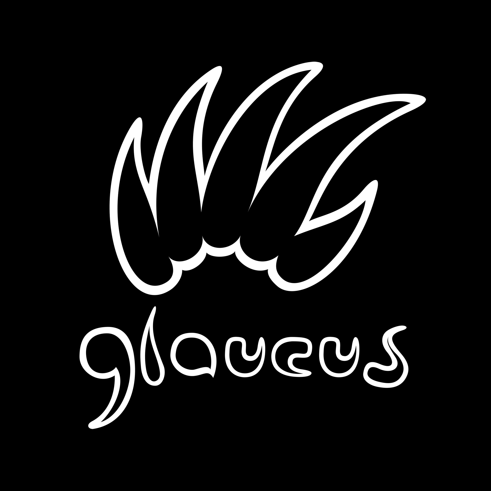
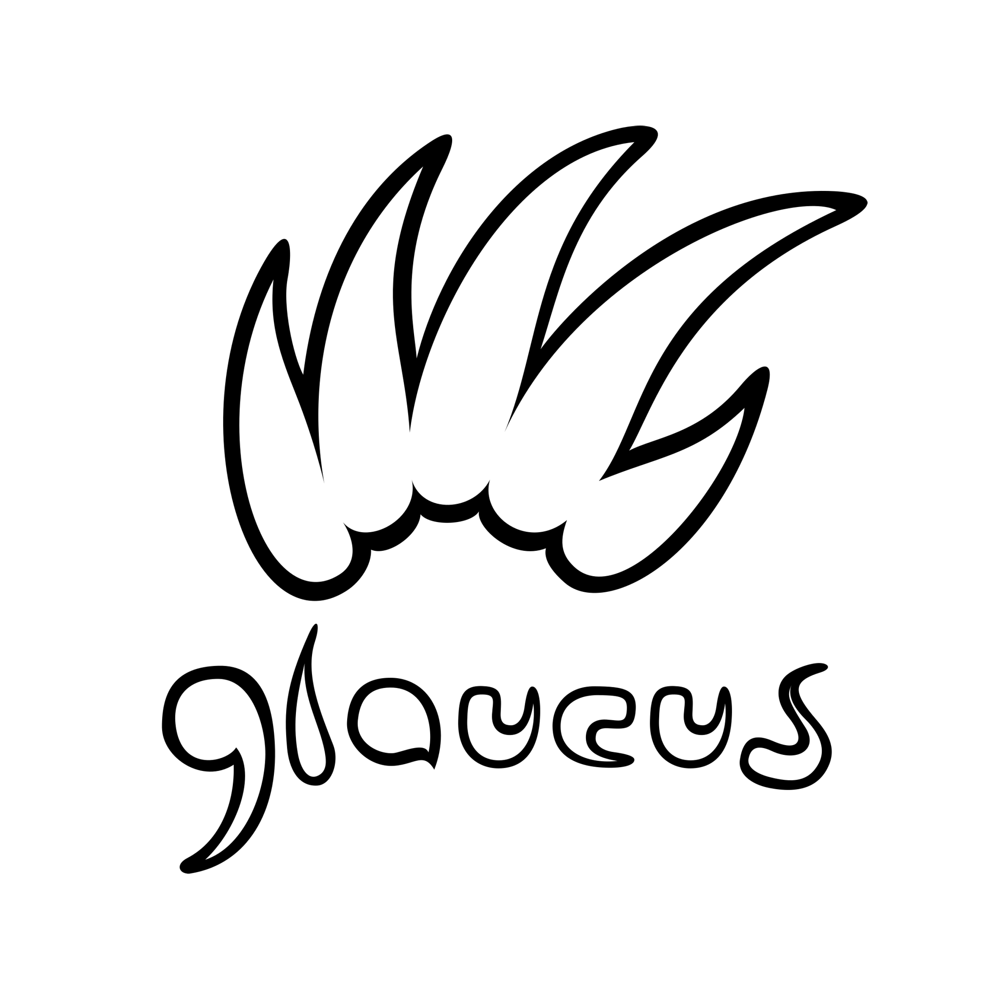
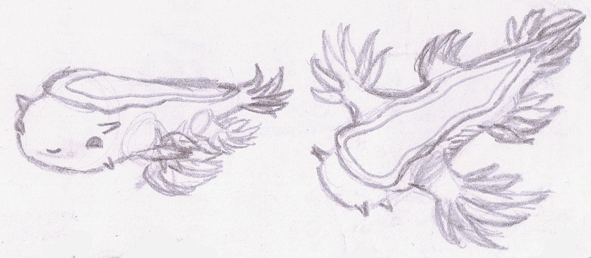
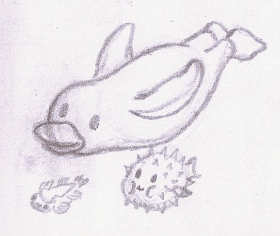

# artwork
[](
https://app.codacy.com/gh/glaucuslinux/artwork?utm_source=github.com&utm_medium=referral&utm_content=glaucuslinux/artwork&utm_campaign=Badge_Grade_Dashboard)
[](
https://gitter.im/glaucuslinux/artwork?utm_source=badge&utm_medium=badge&utm_campaign=pr-badge&utm_content=badge)

glaucus's artwork

## Andy Cuccaro

### Logo

#### glaucus logo


"glaucus-logo.svg" by Andy Cuccaro is licensed under CC-BY-SA-4.0

#### glaucus logo black


"glaucus-logo-black.png" by Andy Cuccaro is licensed under CC-BY-SA-4.0

#### glaucus logo black bg


"glaucus-logo-black-bg.png" by Andy Cuccaro is licensed under CC-BY-SA-4.0

#### glaucus logo white


"glaucus-logo-white.png" by Andy Cuccaro is licensed under CC-BY-SA-4.0

#### glaucus logo white bg


"glaucus-logo-white-bg.png" by Andy Cuccaro is licensed under CC-BY-SA-4.0

### Sketches
#### Glaucus Sketches


"Glaucus-Sketches.jpg" by Andy Cuccaro is licensed under CC-BY-SA-4.0

#### Tux Puffy Glaucus


"Tux-Puffy-Glaucus.jpg" by Andy Cuccaro is licensed under CC-BY-SA-4.0

## ASCII
### glaucus big
```
        _
       | |
   __ _| | __ _ _   _  ___ _   _ ___
  / _` | |/ _` | | | |/ __| | | / __|
 | (_| | | (_| | |_| | (__| |_| \__ \
  \__, |_|\__,_|\__,_|\___|\__,_|___/
   __/ |
  |___/

```

### glaucus bloody
```
  ▄████  ██▓    ▄▄▄       █    ██  ▄████▄   █    ██   ██████
 ██▒ ▀█▒▓██▒   ▒████▄     ██  ▓██▒▒██▀ ▀█   ██  ▓██▒▒██    ▒
▒██░▄▄▄░▒██░   ▒██  ▀█▄  ▓██  ▒██░▒▓█    ▄ ▓██  ▒██░░ ▓██▄
░▓█  ██▓▒██░   ░██▄▄▄▄██ ▓▓█  ░██░▒▓▓▄ ▄██▒▓▓█  ░██░  ▒   ██▒
░▒▓███▀▒░██████▒▓█   ▓██▒▒▒█████▓ ▒ ▓███▀ ░▒▒█████▓ ▒██████▒▒
 ░▒   ▒ ░ ▒░▓  ░▒▒   ▓▒█░░▒▓▒ ▒ ▒ ░ ░▒ ▒  ░░▒▓▒ ▒ ▒ ▒ ▒▓▒ ▒ ░
  ░   ░ ░ ░ ▒  ░ ▒   ▒▒ ░░░▒░ ░ ░   ░  ▒   ░░▒░ ░ ░ ░ ░▒  ░ ░
░ ░   ░   ░ ░    ░   ▒    ░░░ ░ ░ ░         ░░░ ░ ░ ░  ░  ░
      ░     ░  ░     ░  ░   ░     ░ ░         ░           ░
                                  ░

```

### glaucus chunky
```
        __
.-----.|  |.---.-.--.--.----.--.--.-----.
|  _  ||  ||  _  |  |  |  __|  |  |__ --|
|___  ||__||___._|_____|____|_____|_____|
|_____|

```

### glaucus colossal
```
         888
         888
         888
 .d88b.  888  8888b.  888  888  .d8888b 888  888 .d8888b
d88P"88b 888     "88b 888  888 d88P"    888  888 88K
888  888 888 .d888888 888  888 888      888  888 "Y8888b.
Y88b 888 888 888  888 Y88b 888 Y88b.    Y88b 888      X88
 "Y88888 888 "Y888888  "Y88888  "Y8888P  "Y88888  88888P'
     888
Y8b d88P
 "Y88P"

```

### glaucus elite
```
 ▄▄ • ▄▄▌   ▄▄▄· ▄• ▄▌ ▄▄· ▄• ▄▌.▄▄ ·
▐█ ▀ ▪██•  ▐█ ▀█ █▪██▌▐█ ▌▪█▪██▌▐█ ▀.
▄█ ▀█▄██▪  ▄█▀▀█ █▌▐█▌██ ▄▄█▌▐█▌▄▀▀▀█▄
▐█▄▪▐█▐█▌▐▌▐█ ▪▐▌▐█▄█▌▐███▌▐█▄█▌▐█▄▪▐█
·▀▀▀▀ .▀▀▀  ▀  ▀  ▀▀▀ ·▀▀▀  ▀▀▀  ▀▀▀▀

```

### glaucus four tops
```
    |
/~~||/~~||   |/~~|   |(~
\__||\__| \_/|\__ \_/|_)
\__|

```

### glaucus fuzzy
```
      .-.
      : :
 .--. : :   .--.  .-..-. .--. .-..-. .--.
' .; :: :_ ' .; ; : :; :'  ..': :; :`._-.'
`._. ;`.__;`.__,_;`.__.'`.__.'`.__.'`.__.'
 .-. :
 `._.'

```

### glaucus ghoulish
```
   )\.-.    .')         /`-.        .-.     )\.-.       .-.    )\.--.
 ,' ,-,_)  ( /        ,' _  \   ,'  /  )  ,' ,-,_)  ,'  /  )  (   ._.'
(  .   __   ))       (  '-' (  (  ) | (  (  .   _  (  ) | (    `-.`.
 ) '._\ _)  )'._.-.   )   _  )  ) '._\ )  ) '..' )  ) '._\ )  ,_ (  \
(  ,   (   (       ) (  ,' ) \ (  ,   (  (  ,   (  (  ,   (  (  '.)  )
 )/'._.'    )/,__.'   )/    )/  )/ ._.'   )/'._.'   )/ ._.'   '._,_.'

```

### glaucus graffiti
```
        .__
   ____ |  | _____   __ __   ____  __ __  ______
  / ___\|  | \__  \ |  |  \_/ ___\|  |  \/  ___/
 / /_/  >  |__/ __ \|  |  /\  \___|  |  /\___ \
 \___  /|____(____  /____/  \___  >____//____  >
/_____/           \/            \/           \/

```

### glaucus js cursive
```
        _
  __   // __,        __        ,
_(_/__(/_(_/(__(_/__(_,__(_/__/_)_
 _/_
(/

```

### glaucus logo
```
             ,,        ,d88P
           ,d8P    ,ad8888*
         ,888P    d88888*     ,,ad8888P*
    d   d888P   a88888P*  ,ad8888888*
  .d8  d8888:  d888888* ,d888888P*
 .888; 88888b d8888888b8888888P
 d8888J888888a88888888888888P*    ,d
 88888888888888888888888888P   ,,d8*
 888888888888888888888888888888888*
 *8888888888888888888888888888888*
  Y888888888P* `*``*888888888888*
   *^888^*            *Y888P**

```

### glaucus nvscript
```
             ,dPYb,
             IP'`Yb
             I8  8I
             I8  8'
   ,gggg,gg  I8 dP    ,gggg,gg  gg      gg    ,gggg,  gg      gg    ,g,
  dP"  "Y8I  I8dP    dP"  "Y8I  I8      8I   dP"  "Yb I8      8I   ,8'8,
 i8'    ,8I  I8P    i8'    ,8I  I8,    ,8I  i8'       I8,    ,8I  ,8'  Yb
,d8,   ,d8I ,d8b,_ ,d8,   ,d8b,,d8b,  ,d8b,,d8,_    _,d8b,  ,d8b,,8'_   8)
P"Y8888P"8888P'"Y88P"Y8888P"`Y88P'"Y88P"`Y8P""Y8888PP8P'"Y88P"`Y8P' "YY8P8P
       ,d8I'
     ,dP'8I
    ,8"  8I
    I8   8I
    `8, ,8I
     `Y8P"

```

### glaucus ogre
```
       _
  __ _| | __ _ _   _  ___ _   _ ___
 / _` | |/ _` | | | |/ __| | | / __|
| (_| | | (_| | |_| | (__| |_| \__ \
 \__, |_|\__,_|\__,_|\___|\__,_|___/
 |___/

```

### glaucus pepper
```
 _  /_     _      _
/_///_|/_//_ /_/_\
_/

```

### glaucus puffy
```
        _
       (_ )
   __   | |    _ _  _   _    ___  _   _   ___
 /'_ `\ | |  /'_` )( ) ( ) /'___)( ) ( )/',__)
( (_) | | | ( (_| || (_) |( (___ | (_) |\__, \
`\__  |(___)`\__,_)`\___/'`\____)`\___/'(____/
( )_) |
 \___/'

```

### glaucus rectangles
```
     _
 ___| |___ _ _ ___ _ _ ___
| . | | .'| | |  _| | |_ -|
|_  |_|__,|___|___|___|___|
|___|

```

### glaucus robot
```
     _
    ( )
 __ | | ___  _ _  __ _ _  __
/o )( )( o )( U )/ /( U )(_'
\__\/_\/_^_\/___\\_\/___\/__)
 _|/

```

### glaucus roman
```
           oooo
           `888
 .oooooooo  888   .oooo.   oooo  oooo   .ooooo.  oooo  oooo   .oooo.o
888' `88b   888  `P  )88b  `888  `888  d88' `"Y8 `888  `888  d88(  "8
888   888   888   .oP"888   888   888  888        888   888  `"Y88b.
`88bod8P'   888  d8(  888   888   888  888   .o8  888   888  o.  )88b
`8oooooo.  o888o `Y888""8o  `V88V"V8P' `Y8bod8P'  `V88V"V8P' 8""888P'
d"     YD
"Y88888P'

```

### glaucus rounded
```
       _
      | |
  ____| | _____ _   _  ____ _   _  ___
 / _  | |(____ | | | |/ ___) | | |/___)
( (_| | |/ ___ | |_| ( (___| |_| |___ |
 \___ |\_)_____|____/ \____)____/(___/
(_____|

```

### glaucus rozzo
```
         888
 e88 888 888  ,"Y88b 8888 8888  e88'888 8888 8888  dP"Y
d888 888 888 "8" 888 8888 8888 d888  '8 8888 8888 C88b
Y888 888 888 ,ee 888 Y888 888P Y888   , Y888 888P  Y88D
 "88 888 888 "88 888  "88 88"   "88,e8'  "88 88"  d,dP
  ,  88P
 "8",P"

```

### glaucus slant
```
          __
   ____ _/ /___ ___  _________  _______
  / __ `/ / __ `/ / / / ___/ / / / ___/
 / /_/ / / /_/ / /_/ / /__/ /_/ (__  )
 \__, /_/\__,_/\__,_/\___/\__,_/____/
/____/

```

### glaucus small slant
```
        __
  ___ _/ /__ ___ ________ _____
 / _ `/ / _ `/ // / __/ // (_-<
 \_, /_/\_,_/\_,_/\__/\_,_/___/
/___/

```

### glaucus small
```
       _
  __ _| |__ _ _  _ __ _  _ ___
 / _` | / _` | || / _| || (_-<
 \__, |_\__,_|\_,_\__|\_,_/__/
 |___/

```

### glaucus soft
```
       ,--.
 ,---. |  | ,--,--.,--.,--. ,---.,--.,--. ,---.
| .-. ||  |' ,-.  ||  ||  || .--'|  ||  |(  .-'
' '-' '|  |\ '-'  |'  ''  '\ `--.'  ''  '.-'  `)
.`-  / `--' `--`--' `----'  `---' `----' `----'
`---'

```

### glaucus tubular
```
          O~~
          O~~
   O~~    O~~   O~~    O~~  O~~   O~~~O~~  O~~ O~~~~
 O~~  O~~ O~~ O~~  O~~ O~~  O~~ O~~   O~~  O~~O~~
O~~   O~~ O~~O~~   O~~ O~~  O~~O~~    O~~  O~~  O~~~
 O~~  O~~ O~~O~~   O~~ O~~  O~~ O~~   O~~  O~~    O~~
     O~~ O~~~  O~~ O~~~  O~~O~~   O~~~  O~~O~~O~~ O~~
  O~~

```

### glaucus varsity
```
        __
       [  |
  .--./)| |  ,--.  __   _   .---.  __   _   .--.
 / /'`\;| | `'_\ :[  | | | / /'`\][  | | | ( (`\]
 \ \._//| | // | |,| \_/ |,| \__.  | \_/ |, `'.'.
 .',__`[___]\'-;__/'.__.'_/'.___.' '.__.'_/[\__) )
( ( __))

```

### glaucus whimsy
```
           d8b
           88P
          d88
 d888b8b  888   d888b8b  ?88   d8P d8888b?88   d8P .d888b,
d8P' ?88  ?88  d8P' ?88  d88   88 d8P' `Pd88   88  ?8b,
88b  ,88b  88b 88b  ,88b ?8(  d88 88b    ?8(  d88    `?8b
`?88P'`88b  88b`?88P'`88b`?88P'?8b`?888P'`?88P'?8b`?888P'
       )88
      ,88P
  `?8888P

```

## Community
* [Discord](https://discord.gg/nDKNmNc)
* [Gitter](https://gitter.im/glaucuslinux/artwork)
* [Reddit](https://www.reddit.com/r/glaucus)
* [Telegram](https://t.me/glaucuslinux)
* [Twitter](https://twitter.com/glaucuslinux)
* [YouTube](https://www.youtube.com/channel/UCOpZsBcIF2NvJHuzdP1UP_w)

## Mirrors
* [BitBucket](https://bitbucket.org/glaucuslinux/artwork)
* [Codeberg](https://codeberg.org/glaucuslinux/artwork)
* [Framagit](https://framagit.org/glaucuslinux/artwork)
* [GitHub](https://github.com/glaucuslinux/artwork)
* [GitLab](https://gitlab.com/glaucuslinux/artwork)
* [NotABug](https://notabug.org/glaucuslinux/artwork)
* [SourceForge](https://git.code.sf.net/p/glaucuslinux/artwork)
* [SourceHut](https://git.sr.ht/~glaucuslinux/artwork)
