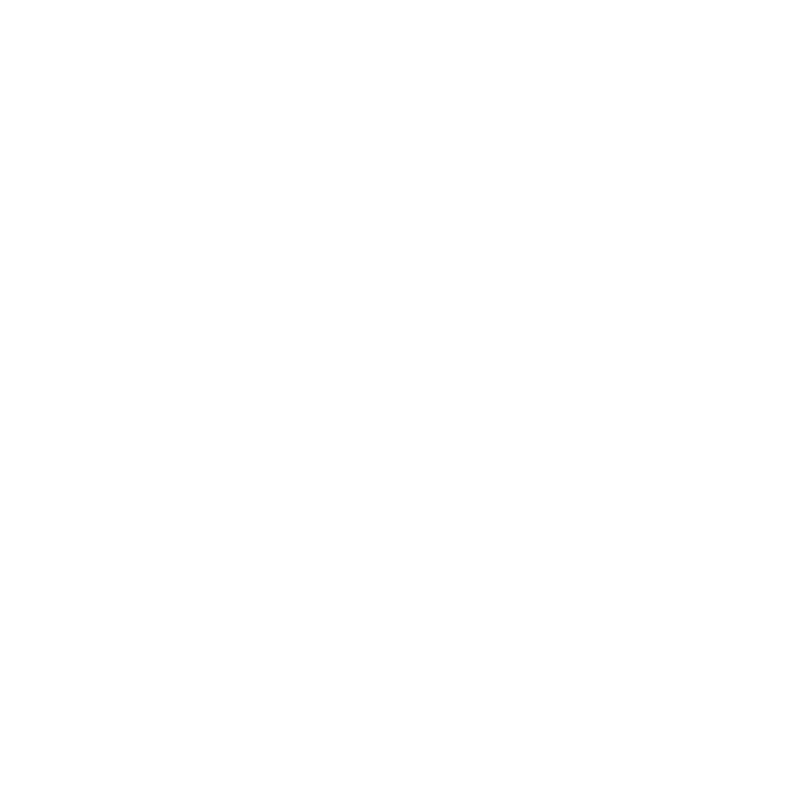

# artwork

glaucus's artwork

## Andy Cuccaro

### Logo

#### glaucus logo

"glaucus-logo.svg" by Andy Cuccaro is licensed under CC-BY-SA-4.0

#### glaucus logo black

"glaucus-logo-black.png" by Andy Cuccaro is licensed under CC-BY-SA-4.0

#### glaucus logo black bg

"glaucus-logo-black-bg.png" by Andy Cuccaro is licensed under CC-BY-SA-4.0

#### glaucus logo white

"glaucus-logo-white.png" by Andy Cuccaro is licensed under CC-BY-SA-4.0

#### glaucus logo white bg

"glaucus-logo-white-bg.png" by Andy Cuccaro is licensed under CC-BY-SA-4.0

### Sketches
#### Glaucus Sketches

"Glaucus-Sketches.jpg" by Andy Cuccaro is licensed under CC-BY-SA-4.0

#### Tux Puffy Glaucus

"Tux-Puffy-Glaucus.jpg" by Andy Cuccaro is licensed under CC-BY-SA-4.0

## More Ideas
Some artwork ideas:

* glaucus loves swimming in the sea (the network sea) with Tux (the Linux
  mascot) and Puffy (the OpenBSD mascot)

* all 4 flavours of glaucus swimming together with atlanticus leading the pack,
  and thompsoni as his right-hand scientist that ensures they're all secure, and
  bennettae being the smallest of the bunch, and albino being the purest of them
  all (refer to the [Naming Convention](
  https://github.com/glaucuslinux/glaucus/wiki/Naming-Convention) page on the
  wiki if you didn't understand a word of what I just said).

Please submit your artwork/ideas to <[firasuke@glaucuslinux.org](
mailto:firasuke@glaucuslinux.org)>

## Community
* [Discord](https://discord.gg/gZSHj65)
* [Gitter](https://gitter.im/glaucuslinux/artwork)
* [Reddit](https://www.reddit.com/r/glaucus)
* [Telegram](https://t.me/glaucuslinux)

## Donate
* [Ko-fi](https://ko-fi.com/glaucuslinux)
* [Liberapay](https://liberapay.com/glaucuslinux)
* [Patreon](https://www.patreon.com/glaucuslinux)
* [PayPal](https://www.paypal.me/glaucuslinux)

## Mirrors
* [BitBucket](https://bitbucket.org/glaucuslinux/artwork)
* [Framagit](https://framagit.org/glaucuslinux/artwork)
* [GitHub](https://github.com/glaucuslinux/artwork)
* [GitLab](https://gitlab.com/glaucuslinux/artwork)
* [NotABug](https://notabug.org/glaucuslinux/artwork)
* [SourceForge](https://git.code.sf.net/p/glaucuslinux/artwork)
* [SourceHut](https://git.sr.ht/~glaucuslinux/artwork)
